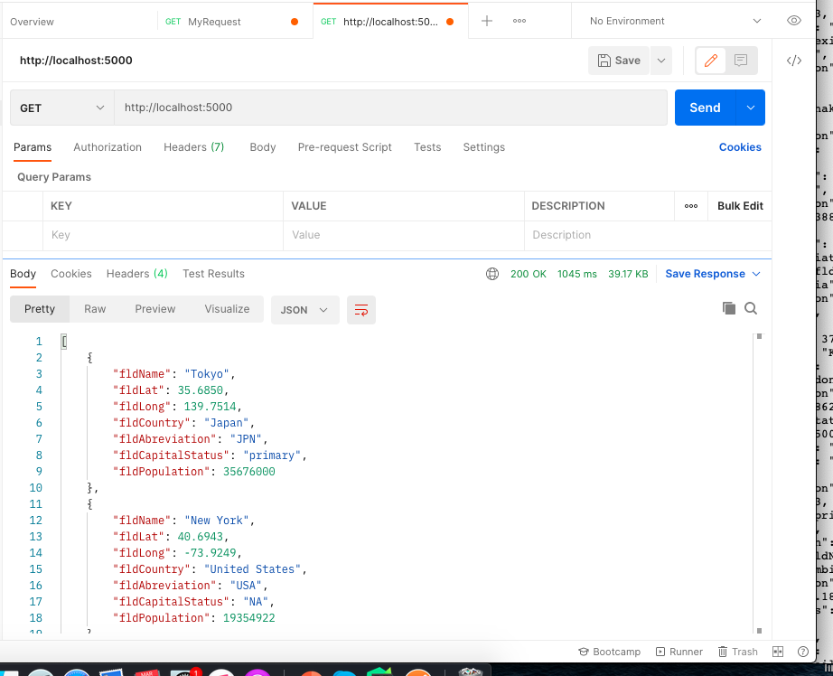
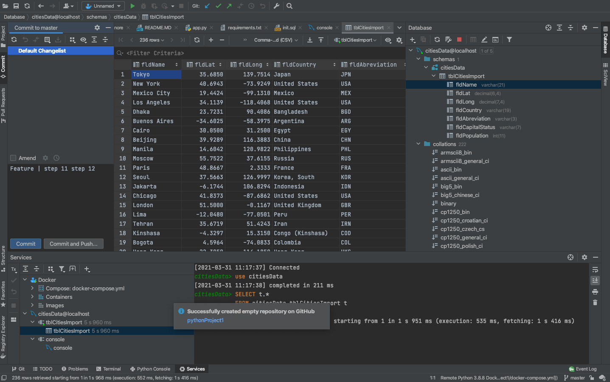

# Project Description
This project is a homework assignment to teach how to get Pycharm setup with DOcker, Flask, MySQL

[Download Assignment Here](PPPSQL-Homework.pdf)
[View Assignment Video Here]()
# Postman Screenshot

# SQL Data Screenshot
